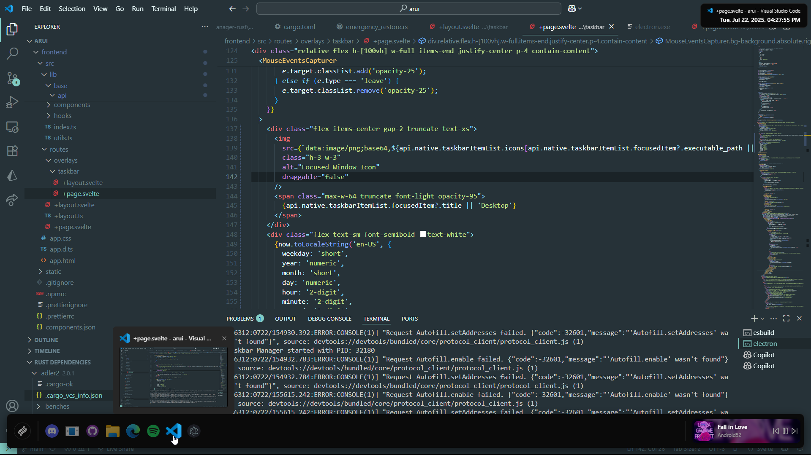

# ARUI Pre-alpha
An another attempt to refresh windows's entire desktop ui.

ARUI is a desktop UI that aims to provide a modern and customizable user interface for Windows.
It features a taskbar, start menu, and various overlays that enhance the user experience. The project is built using modern web technologies and aims to provide a seamless integration with the Windows operating system.

### Pre-Alpha
This project is in pre-alpha stage, which means it is not yet stable and may contain bugs. It is not recommended for production use, but you can try it out and contribute to its development.

### Preview

### Development
To start in development mode you need to run multiple proccesses in same time.
- First `cd frontend` and `pnpm dev`
- Secondly `cd renderer` and `pnpm start`.
Then you can enjoy the real-time development experience.